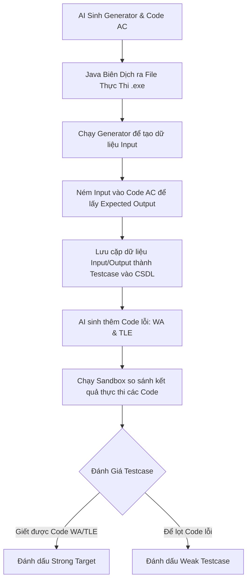

# 🚀 DCPN - Hệ Thống Tự Động Sinh & Đánh Giá Testcase Bằng AI

*Một đường ống (pipeline) tự động hóa quy trình kiểm thử và đánh giá mã nguồn lập trình sử dụng sức mạnh của Trí tuệ Nhân tạo.*

---

## 📌 Tổng Quan Dự Án

Dự án **DCPN** là giải pháp toàn diện giúp tự động hóa quy trình kiểm thử mã nguồn cho các bài tập lập trình (Competitive Programming/Computer Science). Hệ thống sử dụng các mô hình AI tiên tiến (như Groq, Gemini, OpenAI) để:

* Phân tích yêu cầu đề bài (từ văn bản hoặc hình ảnh đề bài).
* Tự động sinh bộ dữ liệu kiểm thử (testcases) cực mạnh và đa dạng.
* Tạo mã nguồn mẫu hoàn chỉnh (AC - Đúng tuyệt đối, WA - Sai thuật toán biên, TLE - Vét cạn quá thời gian).
* Biên dịch và chấm điểm mã nguồn nộp vào thông qua một sandbox thực thi bảo mật, an toàn và tối ưu hiệu năng.

---

## 🚀 Các Tính Năng & Cải Tiến Nổi Bật

### 1. Phá Bỏ Giới Hạn Cứng Bộ Testcase

* **Trước đây:** Hệ thống bị giới hạn chạy đúng 2 Testcase mẫu được gán thủ công trong mã nguồn (`buildMockTestCases()`).
* **Hiện tại:** Đã chuyển đổi thành công sang kiến trúc tự động hóa hoàn chỉnh. Người dùng có thể cấu hình sinh và đánh giá số lượng testcase tùy ý (ví dụ: 20, 50, 100...) thông qua phương thức điều phối `runAutomatedEvaluation`.

### 2. Chiến Lược Bao Phủ Dữ Liệu Thông Minh (Coverage Strategy)

Hệ thống không sinh dữ liệu ngẫu nhiên vô nghĩa mà áp dụng công thức phân bổ dữ liệu khoa học giúp tối ưu hóa khả năng bắt lỗi mã nguồn:

* **20% Edge Cases (Biên đặc biệt):** Bẫy các ranh giới nhạy cảm như mảng rỗng, giá trị $N = 0$, số cực âm, số cực lớn...
* **20% Max Cases (Giới hạn chịu tải):** Sử dụng các testcase có kích thước dữ liệu lớn tối đa ($N = 10^5, 10^6$) nhằm bóp nghẹt thuật toán kém tối ưu $O(N^2)$, ép lộ diện lỗi TLE (Quá thời gian) hoặc MLE (Tràn bộ nhớ).
* **60% Random Cases (Ngẫu nhiên thông thường):** Kiểm tra tính đúng đắn và tính tổng quát trong điều kiện bình thường.

### 3. Tích Hợp Thư Viện Thi Đấu Chuẩn `testlib.h`

* **Thách thức:** AI chỉ sinh mã nguồn C++ sinh dữ liệu (Generator) dưới dạng văn bản thô, không thể thực thi trực tiếp và thường thiếu thư viện hỗ trợ sinh số ngẫu nhiên chuẩn hóa.
* **Giải pháp:** Đã tải và tích hợp thành công thư viện chuẩn `testlib.h` vào thư mục `lib`.
* **Cơ chế Workspace Tạm (Temp Workspace):** Hệ thống tự động gom `testlib.h`, mã `gen.cpp` (Generator), và `ac.cpp` (Solution chuẩn) vào thư mục tạm, sau đó gọi trình biên dịch `g++ -O2 -std=c++17` để sinh trực tiếp file chạy `.exe` tối ưu và an toàn.

### 4. Động Cơ Đánh Giá Sức Mạnh Bộ Testcase (Testcase Strength Engine)

Quy trình tự hành khép kín (End-to-End Lifecycle) cực mượt của `EvaluationController`:



*Sandbox lõi (`BaseCodeExecutor`) được trang bị tính năng chống vòng lặp vô hạn và chống tràn bộ nhớ.*

---

## 🛠️ Nhật Ký Sửa Lỗi & Tối Ưu Hệ Thống

Dưới đây là các vấn đề kỹ thuật lớn phát sinh trong quá trình vận hành và giải pháp tối ưu đã được triển khai:

### 1. Lỗi Biên Dịch C++ Generator do Thiếu Thư Viện Dòng Lệnh

* **Vấn đề:** Trình biên dịch báo lỗi do mã nguồn sinh sinh dữ liệu từ AI thiếu các chỉ thị tiền xử lý cơ bản, không nhận diện được `cout`, `endl`.
* **Khắc phục:** Điều chỉnh System Prompt trong [AIService.java](file:///d:/Code/Java/laptrinh_JAVA/src/bll/AIService.java) ép buộc AI luôn phải đính kèm đầy đủ thư viện `#include <iostream>` và không gian tên `using namespace std;` lên đầu mọi file Generator.

### 2. Quản Lý Cấu Hình API Key

* **Vấn đề:** Nơi cấu hình API Key dịch vụ Groq phục vụ tính năng AI chưa rõ ràng.
* **Khắc phục:** Cấu hình API Key được thiết lập trực tiếp khi khởi tạo `TeacherController` tại [TeacherFrame.java](file:///d:/Code/Java/laptrinh_JAVA/src/gui/DashboardFrame.java). Người dùng chỉ cần thay chuỗi `"gsk_..."` bằng API Key thực tế để vận hành.

### 3. Lỗi Hết Thời Gian Biên Dịch (Compile TIMEOUT)

* **Vấn đề:** Khi biên dịch mã nguồn C++ có nhúng thư viện đồ sộ `testlib.h` kèm cờ tối ưu `-O2`, trình biên dịch `g++` tốn nhiều thời gian phân tích, vượt quá giới hạn 15 giây mặc định dẫn đến lỗi TIMEOUT.
* **Khắc phục:** Nâng giới hạn thời gian chờ biên dịch trong `EvaluationController.java` từ 15 giây lên **60 giây**.

### 4. Lỗi Kẹt Tiến Trình (Deadlock) & Treo Hệ Thống Khi Chạy Testcase Siêu Lớn ($10^6, 10^9$)

* **Vấn đề:** Gặp hiện tượng deadlock bộ đệm hệ điều hành (OS Buffer Overflow). Tiến trình C++ in ra màn hình lượng dữ liệu khổng lồ vượt quá sức chứa bộ đệm OS (chỉ khoảng 4KB - 8KB) và đứng đợi Java đọc; trong khi đó, Java lại dùng lệnh chặn `.waitFor()` chờ C++ chạy xong mới bắt đầu đọc dữ liệu. Hai tiến trình đứng chờ nhau vĩnh viễn gây treo hệ thống.
* **Khắc phục:**
  1. Tăng thời gian thực thi tối đa cho mỗi tiến trình chạy testcase lên **300 giây** (5 phút).
  2. Thay đổi cơ chế I/O trong `EvaluationController.java`: Sử dụng tính năng Redirect Output/Input của `ProcessBuilder` ghi trực tiếp dữ liệu vào file vật lý tạm thời trên ổ cứng (`input_i.txt`, `output_i.txt`). Java chỉ tiến hành đọc file sau khi tiến trình C++ kết thúc và giải phóng tài nguyên hệ thống an toàn.

---

## 👥 Phân Phối Vai Trò & Lộ Trình Phát Triển

### Phân Phân Vai Trò Chi Tiết (Nhóm 4 Người)

| Thành Viên                     | Vai Trò & Tầng Đảm Nhiệm                          | Nhiệm Vụ Chính                                                                                                                                                                                                                                                                                                                                                                                 | Kỹ Năng Yêu Cầu                                                                |
| :------------------------------- | :----------------------------------------------------- | :------------------------------------------------------------------------------------------------------------------------------------------------------------------------------------------------------------------------------------------------------------------------------------------------------------------------------------------------------------------------------------------------ | :--------------------------------------------------------------------------------- |
| **Trần Văn Phát**            | **Backend & Tầng Dữ Liệu (Data Layer)**       | • Thiết kế lược đồ CSDL (`Problem`, `TestCase`, `SampleCode`, `Checker`...).`<br>`• Viết các lớp DAO thực hiện kết nối JDBC, thêm/sửa/xóa/truy vấn dữ liệu.`<br>`• Xây dựng các lớp Model POJO ánh xạ cơ sở dữ liệu.`<br>`• Quản lý file cấu hình, chuẩn bị dữ liệu mẫu phục vụ kiểm thử.                                             | Java Core, JDBC, Thiết kế CSDL quan hệ, SQL Server.                             |
| **Nguyễn Duy Trọng Đức**    | **Tích hợp AI (AI Service Layer)**             | • Kết nối API AI (Groq, Gemini...), xử lý API Key, timeout và cơ chế gọi lại (retry).`<br>`• Thiết kế Prompt sinh dữ liệu kiểm thử (JSON), mã nguồn mẫu (AC/WA/TLE) và Checker.`<br>`• Parse phản hồi JSON từ AI thành các đối tượng Java tương ứng.`<br>`• Tích hợp OCR (Tess4J) hoặc model multimodal để xử lý ảnh đề bài.                  | HTTP Client, Xử lý JSON (Gson/Jackson), Prompt Engineering.                      |
| **Nguyễn Văn Nam**            | **Thực Thi & Sandbox (Sandbox & Evaluation)**   | • Dựng môi trường chạy an toàn (`ProcessBuilder`) hỗ trợ đa ngôn ngữ (C++, Java, Python...).`<br>`• Quản lý tiến trình: giới hạn thời gian (Timeout), dung lượng bộ nhớ, bắt lỗi ngoại lệ.`<br>`• Thực thi chấm thử các mã lỗi (WA, TLE) để đánh giá độ mạnh của testcase.`<br>`• Tích hợp cơ chế so khớp kết quả bằng file Checker. | System Processes, Luồng I/O, Multi-threading, hiểu biết về trình biên dịch. |
| **Trương Đình Chiến** | **Giao Diện & Điều Phối (GUI & Controller)** | • Phát triển toàn bộ giao diện người dùng (JavaFX hoặc Swing) đẹp mắt và mượt mà.`<br>`• Thiết kế các form nhập đề, bảng hiển thị testcase, vùng chọn mã mẫu và hiển thị báo cáo.`<br>`• Viết Controller điều phối luồng: xử lý tác vụ nền bất đồng bộ để tránh đơ giao diện (`Platform.runLater`).                                | JavaFX/Swing, Mô hình MVC, Thiết kế UI/UX, Đa luồng trong UI.                |

### Lộ Trình Thực Hiện Đề Xuất (6 Tuần)

* **[ ] Tuần 1 (Thiết kế & Khởi tạo):** Thống nhất kiến trúc hệ thống và giao diện API (Interfaces). A thiết kế CSDL, B thử nghiệm Prompts, C dựng Sandbox đơn giản, D thiết kế mockup giao diện.
* **[ ] Tuần 2 - 3 (Hiện thực hóa core):** A hoàn thiện DAO, B hoàn tất parser JSON từ AI, C viết xong cơ chế chạy code và so khớp output, D code giao diện nhập liệu cơ bản.
* **[ ] Tuần 4 (Tích hợp dây chuyền 1):** Tích hợp chuỗi chức năng: GUI ➔ Gọi AI sinh testcase ➔ Lưu DB ➔ Hiển thị lên giao diện. C kiểm thử Sandbox với dữ liệu giả lập.
* **[ ] Tuần 5 (Tích hợp dây chuyền 2):** Hoàn thiện module đánh giá: Nhập code mẫu ➔ Thực thi qua bộ testcase sinh ra ➔ Xuất báo cáo độ mạnh/yếu trực quan.
* **[ ] Tuần 6 (Đánh giá & Hoàn thiện):** Kiểm thử tích hợp toàn diện (UAT), xử lý triệt để các trường hợp biên và lỗi kết nối, đóng gói ứng dụng và viết tài liệu hướng dẫn.

---

## 🗃️ Thiết Kế Cơ Sở Dữ Liệu (DDL - SSMS)

Dưới đây là kịch bản SQL Server Management Studio (SSMS) để khởi tạo toàn bộ cấu trúc dữ liệu cho dự án:

```sql
-- 1. Tạo Database mới và làm sạch các bảng cũ nếu đã tồn tại
CREATE DATABASE DCPNDB;
GO
USE DCPNDB;
GO

DROP TABLE IF EXISTS EvaluationResult;
DROP TABLE IF EXISTS Submission;
DROP TABLE IF EXISTS TestCase;
DROP TABLE IF EXISTS SampleCode;
DROP TABLE IF EXISTS Checker;
DROP TABLE IF EXISTS Problem;
GO

-- 2. Tạo Bảng Problem (Lưu thông tin đề bài)
CREATE TABLE Problem (
  id INT IDENTITY(1,1) PRIMARY KEY,
  title NVARCHAR(512) NOT NULL,
  content NVARCHAR(MAX),
  timeLimitMs INT,
  memoryLimitMb INT,
  source NVARCHAR(256)
);

-- 3. Tạo Bảng TestCase (Lưu bộ testcase được sinh tự động hoặc gán tay)
CREATE TABLE TestCase (
  id INT IDENTITY(1,1) PRIMARY KEY,
  problemId INT NOT NULL,
  inputData NVARCHAR(MAX),
  expectedOutput NVARCHAR(MAX),
  isHidden BIT DEFAULT 0,
  strengthStatus NVARCHAR(64),
  CONSTRAINT FK_TestCase_Problem FOREIGN KEY (problemId) REFERENCES Problem(id) ON DELETE CASCADE
);

-- 4. Tạo Bảng Submission (Quản lý các bài nộp code thi đấu)
CREATE TABLE Submission (
  id INT IDENTITY(1,1) PRIMARY KEY,
  problemId INT NOT NULL,
  sourceCode NVARCHAR(MAX),
  language NVARCHAR(64),
  finalStatus NVARCHAR(32),
  isReferenceCode BIT DEFAULT 0,
  CONSTRAINT FK_Submission_Problem FOREIGN KEY (problemId) REFERENCES Problem(id) ON DELETE CASCADE
);

-- 5. Tạo Bảng EvaluationResult (Lưu chi tiết kết quả chạy từng testcase)
CREATE TABLE EvaluationResult (
  id INT IDENTITY(1,1) PRIMARY KEY,
  submissionId INT NOT NULL,
  testcaseId INT NOT NULL,
  status NVARCHAR(32),
  actualOutput NVARCHAR(MAX),
  executionTimeMs BIGINT,
  CONSTRAINT FK_Eval_Submission FOREIGN KEY (submissionId) REFERENCES Submission(id) ON DELETE CASCADE,
  CONSTRAINT FK_Eval_TestCase FOREIGN KEY (testcaseId) REFERENCES TestCase(id) ON DELETE NO ACTION
);

-- 6. Tạo Bảng SampleCode (Mã nguồn AC/WA/TLE dùng để kiểm tra độ mạnh bộ testcase)
CREATE TABLE SampleCode (
  id INT IDENTITY(1,1) PRIMARY KEY,
  problemId INT,
  code NVARCHAR(MAX),
  language NVARCHAR(64),
  expectedVerdict NVARCHAR(16),
  CONSTRAINT FK_SampleCode_Problem FOREIGN KEY (problemId) REFERENCES Problem(id) ON DELETE CASCADE
);

-- 7. Tạo Bảng Checker (Mã nguồn chương trình chấm điểm đặc biệt)
CREATE TABLE Checker (
  id INT IDENTITY(1,1) PRIMARY KEY,
  problemId INT,
  code NVARCHAR(MAX),
  language NVARCHAR(64),
  CONSTRAINT FK_Checker_Problem FOREIGN KEY (problemId) REFERENCES Problem(id) ON DELETE CASCADE
);
```
